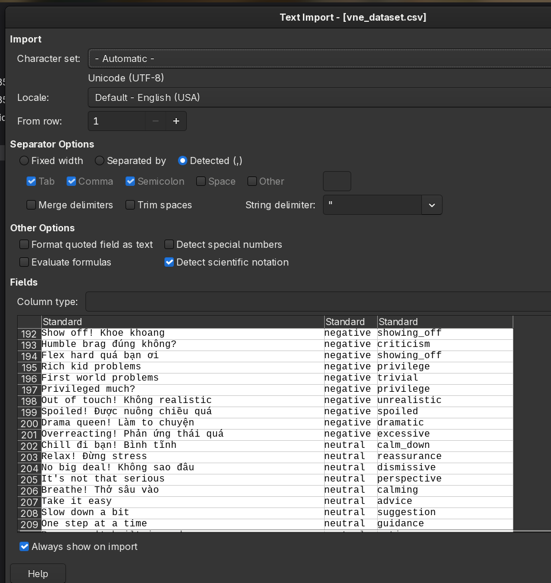

# Self document

A quick docs to write down why A is like that and why I chose B.

## BiLSTM

Its lightweight and takes 1-2GB VRAM to run. That's all. I could use PhoBERT+BiLSTM hybrid, but nah.

## Datasets used

### NOT vanhai123/vietnamese-social-comments

Its bad. Just bad. Complete AI BS. Looks like someone prompted their free Gemini model and regurgitate that as a "dataset".

